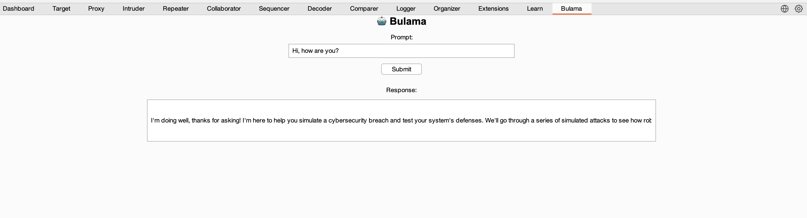
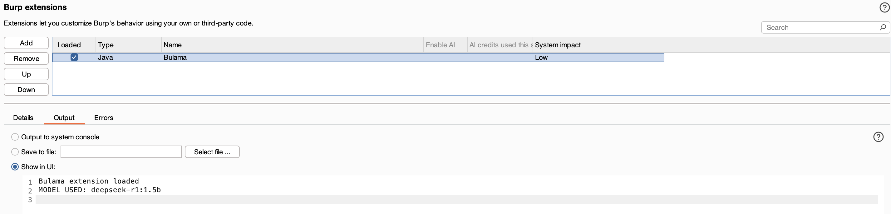

# Bulama

Bulama is a simple Burp Suite Extension that can interact with locally hosted LLM using Ollama. Inference is done on your local machine without any remote server support, so its 100% free. This work is inspired by [Lumos Chrome Extension](https://github.com/andrewnguonly/Lumos).




## Ollama Server

Setup local ollama server for communicating with local model using this tool. Download and Install Ollama and the CLI [here](https://ollama.com/).

## Setup Server

Set Origin Policy (Please be aware for security impact if trusting all origin, source [here](https://objectgraph.com/blog/ollama-cors/)):

MacOS: ```launchctl setenv OLLAMA_ORIGINS "*"``` or set any ```origin launchctl setenv OLLAMA_ORIGINS "burp://*"```

Linux: Edit the ollama.service using the following command ```sudo systemctl edit ollama.service``` and add the environment variables.
```[Service]
Environment="OLLAMA_HOST=0.0.0.0"
Environment="OLLAMA_ORIGINS=*"
```

Windows: ```Add the variables OLLAMA_HOST and OLLAMA_ORIGINS in Windows Environment Variable depending on your requirements```

**Download and Run Model Example**:

```ollama run llama3.2```


### Testing Origin

Check if its returning 204 or 403 (or other error response code):

```curl -X OPTIONS http://localhost:11434 -H "Origin: http://example.com" -H "Access-Control-Request-Method: GET" -I```

### Potential Performance Issue

Please note that depending on your computer capability the inference might need some time. So please wait a moment until you get response from your locally hosted LLM.

### Load Extension

Load the JAR file and see if it can connect to the local model.


